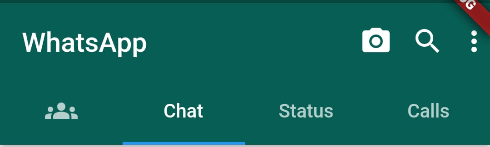
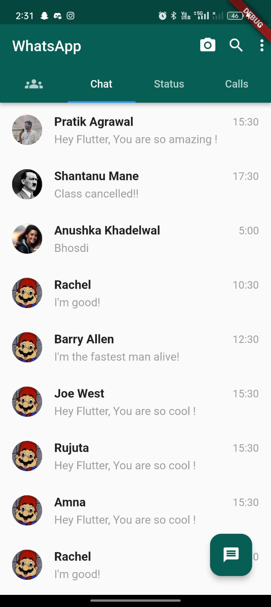

# whatsapp_clone

Creating a WhatsApp Clone using Flutter.  
Flutter Version we are using: Flutter 3.0.5

## App Bar

The code for app bar can be seen at WhatsApp_home.dart  
<a href="lib/WhatsApp_home.dart">Click here</a> to view the code.

## Chat Screen

The code for app bar can be seen at chat_screen.dart  
<a href="lib/pages/chat_screen.dart">Click here</a> to view the code.

## Getting Started

This project is a starting point for a Flutter application.

A few resources to get you started if this is your first Flutter project:

- [Lab: Write your first Flutter app](https://docs.flutter.dev/get-started/codelab)
- [Cookbook: Useful Flutter samples](https://docs.flutter.dev/cookbook)

For help getting started with Flutter development, view the
[online documentation](https://docs.flutter.dev/), which offers tutorials, samples, guidance on
mobile development, and a full API reference.
